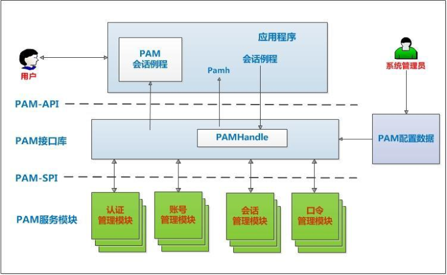

### 概述
PAM(Pluggable Authentication Modules) 一种与认证相关的通用框架机制。
因为每个服务都用到不同的认证方式，所以就需要不同的认证库，认证库有文本文件、MySQL数据库、NIS 、LDAP等，这些库所对应的系统模块位于/lib64/security/目录下的所有库文件(以".so"后缀的文件)。
PAM是关注如何为服务验证用户的API(应用程序接口)，通过提供一些动态链接库和一套统一的API，将系统提供的服务和该服务的认证方式分开。
使得系统管理员可以灵活地根据需要给不同的服务配置不同的认证方式，而无需更改服务程序。

PAM是一种认证框架，自身不做认证，PAM提供了对所有服务进行认证的中央机制，适用于login、远程登录（telnet,rlogin,fsh,ftp, 点对点协议（PPP ））、su等应用程序中。

系统管理员通过PAM配置文件来制定不同应用程序的不同认证策略。
应用程序开发者通过在服务程序中使用PAM API(pam_xxxx( )) 来实现对认证方法的调用。
PAM 服务模块的开发者则利用PAM SPI来编写模块（主要是引出一些函数pam_sm_xxxx( ) 供PAM 接口库调用），将不同的认证机制加入到系统中。
PAM 接口库（libpam ）则读取配置文件，将应用程序和相应的PAM 服务模块联系起来 。

### 认证原理
Service ->PAM(配置文件)->pam_*.so

PAM 认证首先要确定那一项服务，然后加载相应的PAM的配置文件( 位于/etc/pam.d 下) ，最后调用认证文件( 位于/lib/security 下) 进行安全认证。

### 认证过程(以passwd为例)

1. 使用者执行/usr/bin/passwd程序，并输入密码使用者执行/usr/bin/passwd程序，并输入密码
2. passwd开始调用PAM模块，PAM模块会搜寻passwd程序的PAM 相关设定文件，这个设定文件一般是在/etc/pam.d/里边的与程序同名的文件 ，即PAM 会搜寻/etc/pam.d/passwd这个设置文件

3. 经由/etc/pam.d/passwd 设定文件的数据，取用PAM 所提供的相关模块来进行验证
4. 将验证结果回传给passwd 这个程序，而passwd 这个程序会根据PAM回传的结果决定下一个动作（重新输入密码或者通过验证）

### 配置文件

pam的配置文件当中为每种应用定义其需要用到的模块，包括驱动、授权机制等。

1. 模块文件目录：	/lib64/security/*.so
2. 模块配置文件：	/etc/security/*.conf
3. 环境相关的设置：	/etc/security/
4. 主配置文件:	/etc/pam.conf ，默认不存在。    
5. 次级配置文件目录：	/etc/pam.d/，该配置文件目录下的每个配置文件都对应一个应用模块的专用配置文件

注意：如/etc/pam.d 存在，/etc/pam.conf 将失效
1. 模块通过读取模块配置文件完成用户对系统资源的使用控制
2. 注意：修改PAM 配置文件将马上生效
3. 建议：编辑pam规则时 ，保持至少打开一个root会话，以防止root 身份验证错误
4. 通用配置文件/etc/pam.conf 格式application 、type 、control 、module-path 、module-arguments
5. 专用配置文件/etc/pam.d/* 格式type、control、module-path、module-arguments

说明：
1. type（功能，模块类型）：包括auth，account，password，session。
   
	auth: 认证和授权；

	account: 与账号管理相关的非认证功能；
			
    password: 用户修改密码时使用；
	
    session: 用户获取到服务前后使用服务完成后要进行的一些附属性操作
	
    -type:	表示因为缺失而不能加载的模块将不记录到系统日志, 对于那些不总是安装在系统上的模块有用
			
2. control：pam如何处理与该服务相关的pam的成功或失败情况？同一种功能的多个检查之间如何进行组合？有两种实现机制。
	
    1.使用一个关键词来定义：
	
        required:	一票否决，表示本模块必须返回成功才能通过认证，但是如果该模块返回失败，失败结果也不会立即通知用户，而是要等到同一type中的所有模块全部执行完毕再将失败结果返回给应用程序。 必要条件
		requisite:	一票否决，该模块必须返回成功才能通过认证，但是一旦该模块返回失败，将不再执行同一type 内的任何模块，而是直接将控制权返回给应用程序。必要条件
		sufficient:	一票通过， 表明本模块返回成功则通过身份认证的要求，不必再执行同一type内的其它模块，但如果本模块返回失败可忽略。充分条件
		optional:	表明本模块是可选的，它的成功与否不会对身份认证起关键作用，其返回值一般被忽略
		include：	使用其他配置文件中同样功能的相关定义来进行检查
	2.使用一到多组“return status=action”来定义；
	
    [status1=action1  status2=action2....]
	status：指定此项检查的返回值，其可能的取值有多种。如success。
	action：	采取的操作，其可能的取值常用的有6种，如ok，done，die，ignore，bad，reset。
		ok 	模块通过，继续检查
		done  	模块通过，返回最后结果给应用
		bad  	结果失败，继续检查
		die  	结果失败，返回失败结果给应用
		ignore  	结果忽略，不影响最后结果
        reset  	忽略已经得到的结果
	module-path：
			模块路径，用来指明本模块对应的程序文件的路径名。
			相对路径
			绝对路径
			
	module-argument：
			模块参数，用来传递给该模块的参数。
			pam_unix.so：	
			nullok：	允许使用空密码；
			try_first_pass：	提示用户输入密码之前，首先检查此前栈中已经得到的密码；
			pam_env.so：	通过配置文件来为用户设定或撤销环境变量，/etc/security/pam_env.conf
			pam_shells.so：	检查用户使用的是否为合法shell，/etc/shells
			pam_limits.so：	资源限制，/etc/sercurity/limits.conf ；/etc/sercurity/limits.d/*
