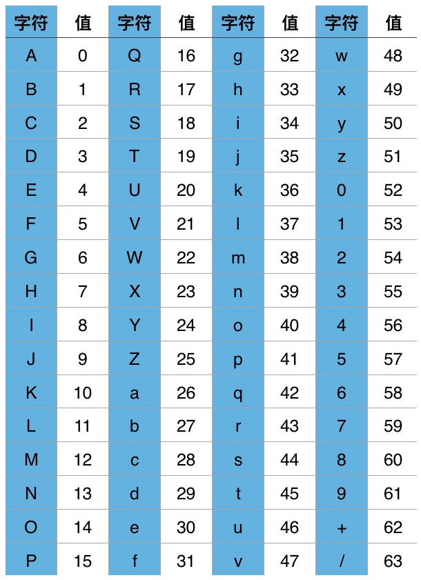

### base64
首先将字符串(图片等)转换成二进制序列，然后按每六个二进制位为一组，分成若干组，如果不足六位，低位补零。每六位组成一个新的字节，高位补零零，构成一个新的二进制序列，最后根据索引表中的值找到对应的字符()。只要原始字符串的长度不能被三整除，后面都是会用零来补充。

### ASCII
ASCII总共规定了128个字符的编码，只占用了一个字节的后七位，最前面的一位统一规定为0

### Unicode
Unicode只是一个符号集，规定了符号的二进制代码，但并没有规定这个二进制如何存储

UTF-8是Unicode的实现方式，其他还包括UTF-16(字符用两个或四个字节表示)和UTF-32(字符用四个字节表示)，最大的特点变长的编码方式，可以使用1-4个字节表示一个符号。
1. 单字节符号，字节的第一位为0，后面的7位为这个符号的Unicode码，因此对于英文字母，UTF-8编码和ASCII是相同的。
2. 对于n(n>1)字节的符号，第一个字节前n位都设为1，第n+1位为0，后面字节的前两位10，剩下的二进制位为这个符号的Unicode码

|Unicode符号范围|UTF-8编码方式|
|---|---|
|0000 0000-0000 007F|0*******|
|0000 0080-0000 07FF|110***** 10******|
|0000 0800-0000 FFFF|1110**** 10****** 10******|
|0001 0000-0010 FFFF|11110*** 10****** 10****** 10******|

严的Unicode是4E25(100111000100101)，根据上表，可以发现4E25处在第三行的范围内，因此需要三个字节，然后从严的最后一个二进制位开始，一次从后向前输入格式中的*，多出的位补0，得到严的UTF-8编码是11100100 10111000 10100101，转换成十六进制就是E4B8A5。
Unicode规范定义，每一个文件的最前面分别加入一个表示编码顺序的字符。如果一个文本文件头两个字节是FEFF，表示该文件采用大头方式；FFFE则是小头方式。

### ANSI
对于英文是ASCII编码，对于简体中文是GB2312编码
