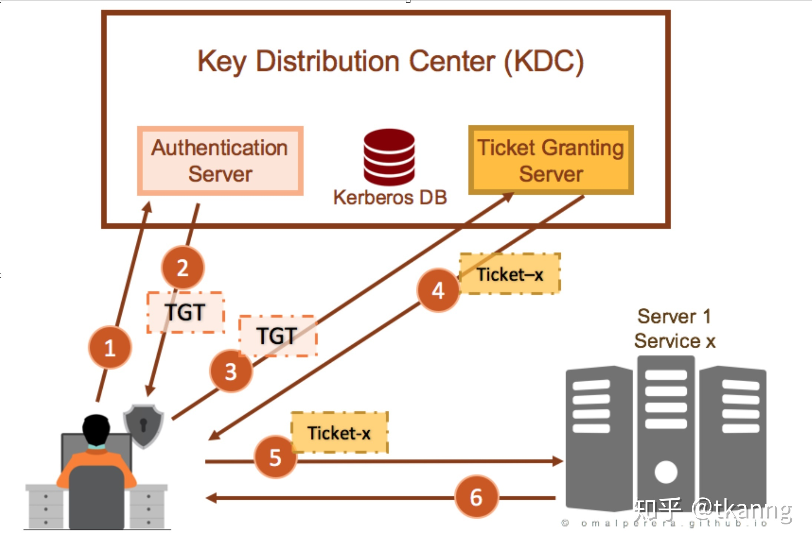

[一文搞定Kerberos](https://zhuanlan.zhihu.com/p/266491528)

https://www.cnblogs.com/websecyw/p/11232210.html

https://blog.csdn.net/wy_97/article/details/87649262

## Kerberos概述
Kerberos 是一种身份认证协议，被广泛运用在大数据生态中，甚至可以说是大数据身份认证的事实标准。
Kerberos 是一种基于加密 Ticket 的身份认证协议。Kerberos 主要由三个部分组成：Key Distribution Center (即KDC)、Client 和 Service。

### 名词解释
|简写|全称|
|---|---|
|DC|Domain Controller 域控|
|KDC|Key Distribution Center 密钥分发中心|
|AD|Account Database 账户数据库|
|AS|Authentication Service 身份验证服务|
|TGS|Ticket Granting Service 票据授与服务|
|TGT|Ticket Granting Ticket 票据中心授予的票据|

1. Principal：大致可以认为是 Kerberos 世界的用户名，用于标识身份。principal 主要由三部分构成：primary，instance(可选) 和 realm。包含 instance 的principal，一般会作为server端的principal，如：NameNode，HiverServer2，Presto Coordinator等；不含有 instance 的principal，一般会作为 客户端的principal，用于身份认证
   |含义||
   |---|---|
   |部署在foo.baidu.com节点的hiveserver2的principal|hiveserver2/foo.baidu.com@QX.COM|
   |用户jack|jack@QX.COM|

2. Keytab："密码本"。包含了多个 principal 与密码的文件，用户可以利用该文件进行身份认证。
3. Ticket Cache：客户端与 KDC 交互完成后，包含身份认证信息的文件，短期有效，需要不断renew。
4. Realm：Kerberos 系统中的一个namespace。不同 Kerberos 环境，可以通过 realm 进行区分。

### KDC
Key Distribution Center（即 KDC）, 是 Kerberos 的核心组件，主要由三个部分组成：

1. Kerberos Database: 包含了一个 Realm 中所有的 principal、密码与其他信息。（默认：Berkeley DB）
2. Authentication Service(AS): 进行用户信息认证，为客户端提供 Ticket Granting Tickets(TGT)。
3. Ticket Granting Service(TGS): 验证 TGT 与 Authenticator，为客户端提供 Service Tickets。

## 域认证 Kerberos 流程
### Authentication Service Exchange 认证服务交换

通过这步骤，AS 实现对 Client 身份的确认，并颁发给该 Client 一个 TGT 。具体过程如下：

client 向 AS 发送 AS Request, 为了确 AS Request 仅限于自己和 KDC 知道，client使用自己的 Master Key（用户密码的一种hash） 对 AS Request 的主体部分进行加密（KDC 可以通 AD 获得该Client 的 Master Key）。

AS Request 的大体包含以下的内容：

Pre-authentication data：被 Client 的 Master key加密过的 Timestamp，用于证明自己是所发送用户名对应的那个用户
Client name & realm: 简单地说就是Domain name\Client name
Server Name：注意这里的 Server Name并不是 Client 真正要访问的 Server 的名称，而我们也说了 TGT 是和 Server 无关的（ Client 只能使用 Ticket ，而不是 TGT 去访问Server ）。这里的 Server Name 实际上是 KDC TGS 的 Server Name。AS 通过它接收到的 AS Request 验证发送方的是否是在 Client name & realm 中声称的那个人，也就是说要验证发送放是否知道 Client 的 Password 。所以 AS 只需从 AD 中提取 Client 对应的 Master Key对 Pre-authentication data 进行解密，如果是一个合法的 Timestamp，则可以证明发送方提供的用户名是存在于白名单中且密码对应正确的。

验证通过之后，AS 将一份 AS Response 发送给 Client。AS Response 主要包含两个部分：本 Client 的 Master Key 加密过的 Logon Session Key 和被自己（KDC）加密的TGT

TGT大体又包含以下的内容：

Session Key: SKDC-Client：Logon Session Key
Client name & realm: 简单地说就是Domain name\Client
End time: TGT到期的时间。
Client 通过自己的 Master Key 对第一部分解密获得 Logon Session Key之后，携带着 TGT 便可以进入下一步：TGS Exchange。

### Ticket Granting Service Exchange 票据授与服务交换
TGS Exchange 通过 Client 向 KDC 中的 TGS 发送 TGS Request 开始。TGS Request大体包含以下的内容：
1. TGT：Client 通过 AS Exchange 获得的 TGT，TGT 被 KDC 的 Master Key 进行加密
2. Authenticator：用以证明当初 TGT 的拥有者是否就是自己， client 端使用 Logon session key 进行加密
3. Client name & realm: 简单地说就是 Domain name\Client 
4. Server name & realm: 简单地说就是 Domain name\Server ，这回是 Client 试图访问的那个 Server
5. 时间戳，同第一步

TGS 收到TGS Request在发给 Client 真正的 Ticket 之前，先得整个 Client 提供的那个 TGT 是否是 AS 颁发给它的。于是它得通过 Client 提供的 Authenticator 来证明。但是 Authentication 是通过 Logon Session Key 进行加密的，而自己并没有保存这个 Session Key 。所以 TGS 先得通过自己的 Master Key 对 Client 提供的 TGT 进行解密，从而获得这个Logon Session Key ，再通过这个 Logon Session Key 解密 Authenticator 进行验证。

换句话说，TGS 接收到请求之后，现通过自己的密钥解密 TGT 并获取 Logon Session Key ，然后通过 Logon Session Key 解密 Authenticator ，进而验证了对方的真实身份。

验证通过向对方发送 TGS Response。这个TGS Response有两部分组成：

1. 使用Logon Session Key（SKDC-Client）加密过用于Client和Server的Session Key（SServer-Client）
2. 使用Server的Master Key进行加密的Ticket。

该Ticket大体包含以下一些内容：

1. Session Key：SServer-Client。
2. Client name & realm: 简单地说就是Domain name\Client。
3. End time: Ticket的到期时间。

Client 收到TGS Response，使用 Logon Session Key，解密第一部分后获得 Session Key （注意区分 Logon Session Key 与 Session Key 分别是什么步骤获得的，及其的区别）。有了 Session Key 和 Ticket ， Client 就可以之间和 Server 进行交互，而无须在通过 KDC 作中间人了。

Client如果使用Ticket和Server怎样进行交互的，这个阶段通过我们的第3个步骤来完成：CS（Client/Server ）Exchange。

###  CS（Client/Server ）Exchange

Client 通过 TGS Exchange 获得 Server 的 Session Key ，随后创建用于证明自己就是 Ticket 的真正所有者的 Authenticator 和时间戳，并使用 Session Key 进行加密。最后将这个被加密过的 Authenticator，时间戳 和 Ticket 作为 Request 数据包发送给 Server 。此外还包含一个 Flag 用于表示 Client 是否需要进行双向验证。

Server 接收到 Request 之后，通过自己的 Master Key 解密 Ticket，从而获得 Session Key 。通过 Session Key 解密 Authenticator ，进而验证对方的身份。验证成功，让 Client 访问需要访问的资源，否则直接拒绝对方的请求。时间戳的作用，同第一步，这里略。

实际上，到目前为止，服务端已经完成了对客户端的验证，但是，整个认证过程还没有结束。谈到认证，很多人都认为只是服务器对客户端的认证，实际上在大部分场合，我们需要的是双向验证（Mutual Authentication）——访问者和被访问者互相验证对方的身份。现在服务器已经可以确保客户端是它所声称的那么用户，客户端还没有确认它所访问的不是一个钓鱼服务呢。

为了解决客户端对服务器的验证，服务要需要将解密后的 Authenticator 再次用 Session Key 进行加密，并发挥给客户端。客户端再用缓存 Session Key 进行解密，如果和之前的内容完全一样，则可以证明自己正在访问的服务器和自己拥有相同 Session Key，而这个会话秘钥不为外人知晓

## Kerberos协议原理
### 背景知识
1. Kerberos 基于 Ticket 实现身份认证，而非密码。如果客户端无法利用本地密钥，解密出 KDC 返回的加密Ticket，认证将无法通过
2. 客户端将依次与 Authentication Service, Ticket Granting Service 以及目标Service进行交互，共三次交互。
3. 客户端与其他组件交互是，都将获取到两条信息，其中一条可以通过本地密钥解密出，另外一条将无法解密出。
4. 客户端想要访问的目标服务，将不会直接与KDC交互，而是通过能否正确解密出客户端的请求来进行认证
5. KDC Database 包含有所有 principal 对应的密码
6. Kerberos 中信息加密方式一般是对称加密（可配置成非对称加密）

### 认证步骤
1. 客户端通过kinit USERNAME或其他方式，将客户端ID, 目标HTTP服务ID, 网络地址（可能是多个机器的IP地址列表，如果想在任何机器上使用，则可能为空），以及TGT有效期的寿命等信息发送给 Authentication Service。
2. Authentication Server 将检查客户端ID是否在KDC数据库中。如果 Authentication Server 检查操作没有异常，那么KDC将随机生成一个 key，用于客户端与 Ticket Granting Service(TGS) 通信。这个Key，一般被称为 TGS Session Key。随后 Authentication Server 将发送两条信息给客户端。示意图如下：
   ![]

其中一条信息被称为TGT，由TGS的密钥加密，客户端无法解密，包含客户端ID, TGS Session Key等信息。另一条信息由客户端密钥加密，客户端可以正常解密，包含目标 HTTP 服务ID，TGS Session Key等信息。

3. 客户端利用本地的密钥解密出第二条信息。如果本地密钥无法解密出信息，那么认证失败。
4.  客户端有了 TGT（由于本地没有TGS的密钥，导致无法解密出其数据）与 TGS Session Key。客户端将AS发送过来的TGT（由TGS密钥加密）转发给TGS，将包含自身信息的Authenticator(由TGS Session Key加密)发送个TGS
5.  TGS 将利用 自身的密钥从TGT中解密出TGS Session Key，然后利用TGS Session Key从Authenticator 中解密出客户端的信息。

