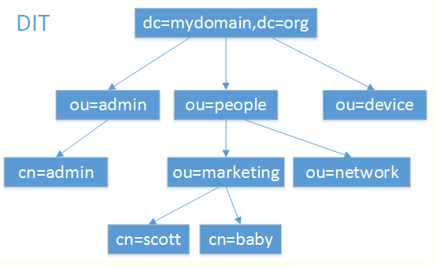

[OpenLdap](https://segmentfault.com/a/1190000014683418)

### LDAP
该协议用来访问目录数据库的，在计算机域中，目录服务数据库存储整个域内所有的计算机、用户等信息。目录服务=服务数据库+访问协议。
目录服务数据库本质上是一个数据库， 用来存储数据的，主要有以下两个特点：
1. 树状组织结构，类似文件目录
2. 为查询、浏览和搜索而优化的数据库，即LDAP的读性能特别强，但是写性能差，而且还不支持事务处理、回滚等复杂功能。

#### LDAP中的DN,CN,OU,DC
LDAP是建立在"条目"(entries)的基础上，具有一个全局唯一的DN(可区分名称)，每个条目具有一个类型和一个或多个值，每个对象都有唯一的名称，如"uid=tom, ou=marker,dc=example,dc=com"

CN(Common Name):公共名称，相当于用户名

OU(Organizational Unit):组织单位，类似于文件系统中的子目录

DC(Domain Component):域名的部分，其格式将完整的域名分成几个部分，如example.com-----dc=example,dc=com

三者都是LDAP连接服务器端字符串的区分名DN(Distinguished Name),LDAP连接服务器的连接字符串格式为：ldap://servername/DN

