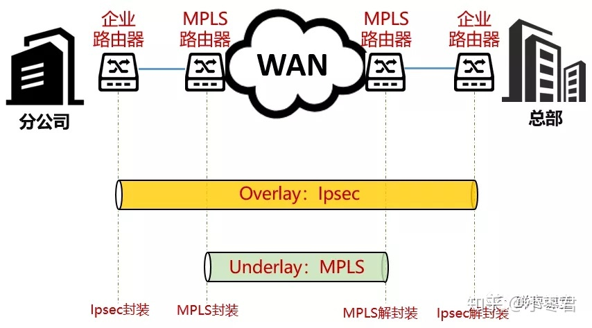

1, P network：运营商核心网络，也就是提供VPN服务供应商自己的网络 "P = provider"

2，C network：客户网络 "C = customer"

3，P device： 运营商网络核心设备

4，PE device：运营商网络边缘设备，用于连接P网络与C网络 "PE = Provider Edge"

5，CE device：客户网络边缘设备，用于连接P网络与C网络 "CE = Customer Edge"

## MPLS
MPLS，Multi-Protocol Label Switching，多协议标签交换。这是一种高效且可靠的网络传输技术。简单来说，它就是在数据流上打标签，有点像鸡毛信，告诉沿路的所有设备：“我是谁，我要去哪里”。

MPLS专线，就是一种基于MPLS技术的广域网服务专用线路

## VPN
根据基于的网络不同，VPN通常包括Ipsec-VPN和MPLS-VPN

Ipsec-VPN，基于Internet的VPN。这个大家平时用得比较多。大公司员工出差在外，都会拨VPN，然后就相当于变成了公司内网，可以访问内网的网站

MPLS-VPN，基于运营商MPLS专用网络的VPN。整个分公司和总部之间，通过这个连接，逻辑上相当于大家都处于一个内网里。

### Peer-to-Peer VPN 与 overlay VPN的区别

1. 在peet-to-peer VPN的实现中，C网络路由会在P网络内传递，P设备也会参与C网络的路由选择，这句话突出的重点就是：P网络与C网络融为一体，C网络路由的任何改变都会影响到P网络
2. 在overlay VPN的实现中，CE对接PE设备，P网络提供所有CE之间的网络可达性，基于这个网络可达性为基准，CE通过隧道技术构建点到点的VPN互联。隧道基于诸如：GRE、L2TP、PPTP、IPsec。VPN隧道把多个分布于不同位置的网络相互互联起来，这些VPN隧道组成的网络就是overlay网络。它们完全独立与底层的P网络，P网络只负责提供VPN隧道的src-dst可达性
   
   

## SD-WAN

1. 接口通吃，负载均衡

SD-WAN不再强制只允许使用MPLS，而是允许MPLS、xSDL、PON光纤宽带、4G LTE，甚至5G等多种连接类型。CPE可以支持多种接口的Bonding（绑定），从而变成了一个接口资源池

2. 自主选择最佳路径

WAN广域网技术的关键，其实在于路径选择。对于不同的分公司，SD-WAN可以根据现网情况和配置策略，自主选择最佳路径。

SD-WAN还具备负载均衡的能力，以此来增强网络的可靠性。

其实在运营商网络里，还有很多POP（point-of-presence，入网点），帮助解决跨运营商之间的链路拥塞和负荷问题。

3. 部署简单，秒速完成

在评价SD-WAN的部署速度时，人们会反复提到一个词，叫做ZTP，也就是Zero Touch Provisioning，零接触部署。简单来说，差不多就是即插即用。

除了CPE上电后自动获取配置之外，还可以用扫码配置或邮件配置的方式。

以邮件部署方式为例。在部署SD-WAN时，总部的IT工程师只需要提前做好配置数据，然后将配置通过邮件的方式，发给分公司的任何员工，该员工即可通过链接，完成设备的配置部署。

就是这么方便和快捷，不再需要专业IT人士到场进行配置安装

4. 自管自控，智能运维

SD-WAN的好处就是省钱又好用。根据测算，同比例带宽情况下，SD-WAN相较MPLS，每年至少可节省30%的成本投资。因此也有人戏称SD-WAN是“Save Dollars（省钱）-WAN”。