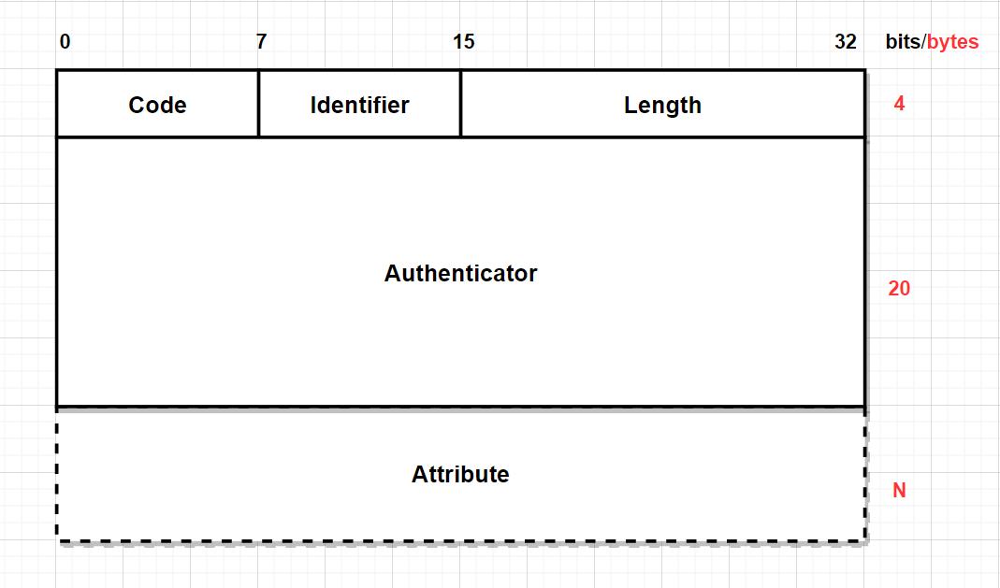
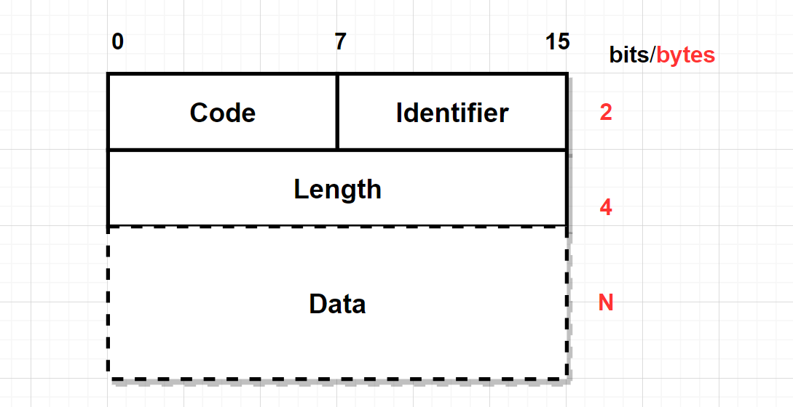
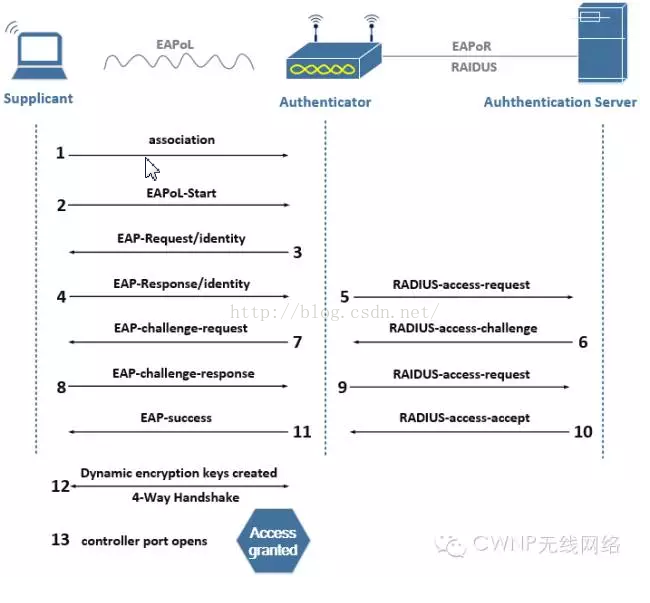
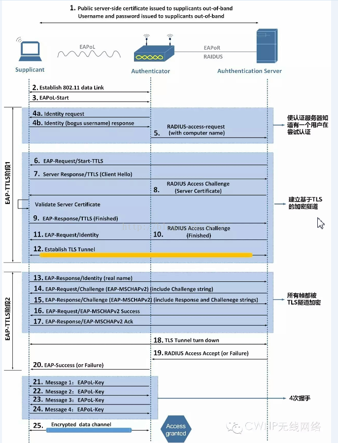
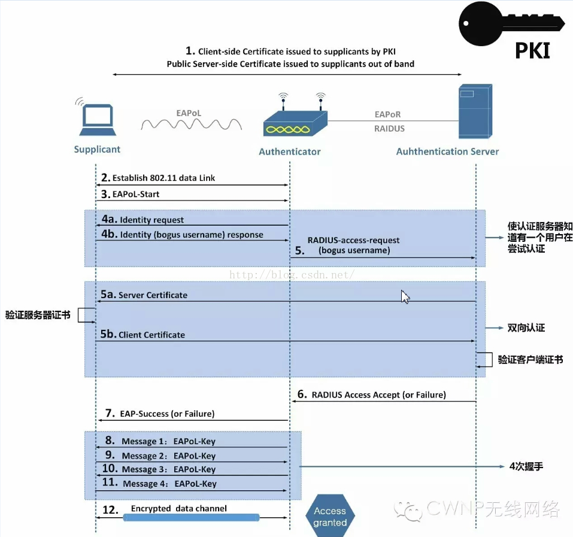
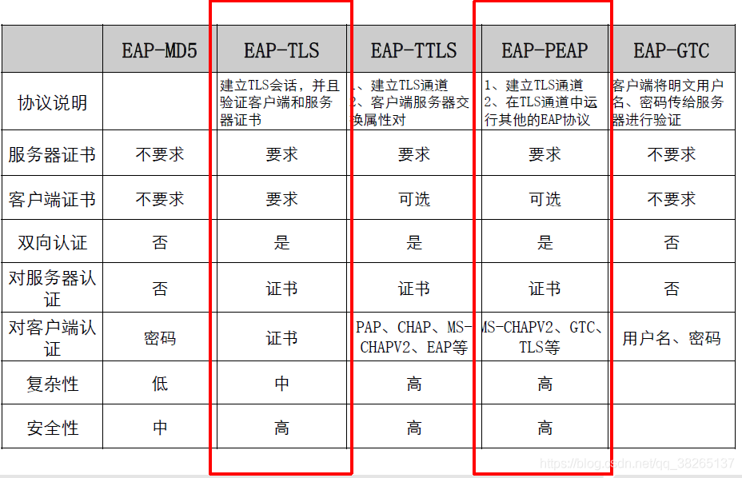
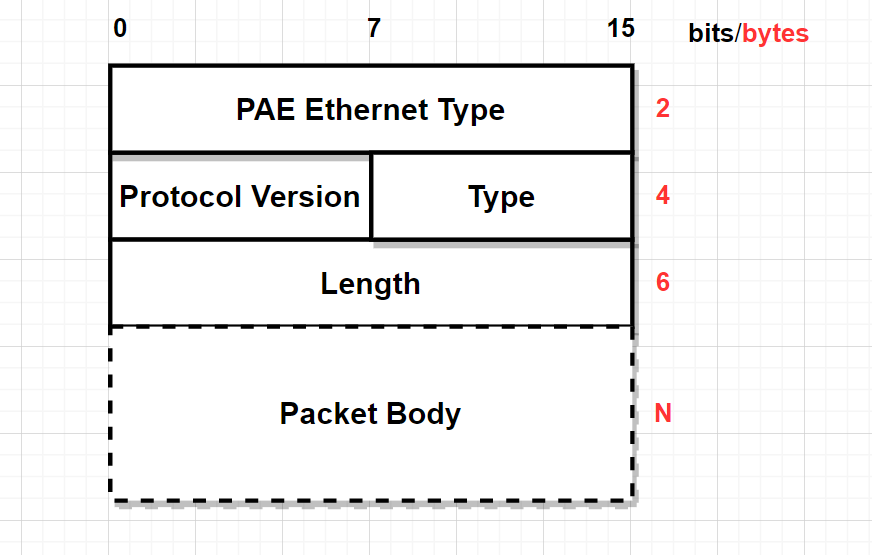
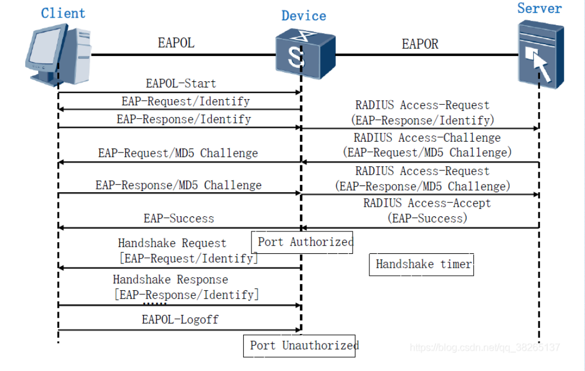

## 802.1x协议
802.1x协议是一种基于端口的网络接入控制协议，即指在局域网接入设备的端口这一级验证用户身份并控制其访问权限。

#### 优点

802.1X认证中为二层协议，不需要到达三层，对接入设备的整体性能要求不高，可以有效降低建网成本。
认证报文和数据报文通过逻辑接口分离，提高安全性

#### 认证系统

典型的CS架构，包括三个实体：客户端、接入设备以及认证服务器

**客户端**一般为用户终端设备，使用客户端软件发起802.1x认证，客户端必须要支持LAN上的可扩展认证协议EAPoL

**接入设备**为支持802.1x协议的网络设备，其为客户端提供接入局域网的端口，作为客户端和认证服务器之间的中介，接收客户端的身份认证信息，与认证服务器进行身份验证信息交互，最后根据身份认证的状态来控制其对网络的访问权限。

**认证服务器**为radius服务器，用于实现对用户进行认证、授权和计费。

## RADIUS

RADIUS远程认证拨入用户服务，是用于NAS和AAA服务器间通信的一种协议。RADIUS对AAA的三个组件都提供支持

当用户想要通过某网络与NAS建立连接从而获得访问其他网络的权利时，NAS可以在NAS上进行本地认证计费，或把用户信息传递给RADIUS服务器，由RADIUS进行认证计费。

RADIUS 协议规定了NAS与RADIUS 服务器之间如何传递用户信息和计费信息，即两者之间的通信规则，RADIUS服务器负责接收用户的连接请求，完成认证，并把用户所需的配置信息返回给NAS。

用户获得授权后，在其正常上线、在线和下线过程中，RADIUS服务器还完成对用户账号计费的功能。

### RADIUS主要特性
#### C/S模式
   
NAS作为RADIUS的客户端，负责将用户信息传递给指定的RADIUS服务器，并负责执行返回的响应。RADIUS服务器接收用户的连接请求，鉴别用户，并为客户端返回为用户提供服务的配置信息。一个RADIUS服务器可以作为其他的RADIUS Server或其他种类认证服务器的代理。

#### 网络安全

客户端和RADIUS服务器之间的事务是通过使用不会在网上传输的共享密钥机制进行鉴别的。另外，在客户端和RADIUS服务器之间的任何用户密码都是被加密后传输的。

#### 灵活的认证机制

PAP CHAP MSCHAP等认证
#### PAP

#### CHAP(Challenge Handshake Authentication Protocol,质询握手认证协议)
CHAP是由认证方发起的认证

1. 认证方发起挑战消息，包括ID(此认证的序列号)、随机数据、认证用户名等。
2. 被认证方接收到挑战信息，根据接收到的认证方的认证用户名到自己本地的数据库中查找对应的密码(如果没有设密码就用默认的密码)，查到密码再结合认证方发来的ID和随机数据使用MD5算法算出一个Hash值。被认证方回复认证请求，响应信息包括ID(跟认证请求中的ID相同)、Hash值、被认证方的认证用户名。
3. 认证方收到响应消息，根据被认证方发来的认证用户名，认证方在本地的数据库中查找被认证方的认证用户名的的密码(口令)，即必须要求认证方和被认证方使用的密码必须相同，结合ID找到先前保存的随机数据，通过口令、ID和随机数使用MD5计算Hash值，与被认证方得到的Hash值进行比较，一致则认证通过，如果不一致，则认证不通过。

#### MSCHAP
1. 客户端向服务器发送一个连接请求；
2. 服务器返回一个 8 字节的随机挑战值Challenge；
3. 客户端使用LAN Manager杂凑算法对用户口令做杂凑得到16字节输出，在其后补5个字节0得到21个字节值，按顺序分割为3个7字节值k1,k2,k3；
4. 分别以k1,k2,k3为密钥对Challenge做DES加密，然后将三个密文块连接为一个24字节的响应；
5. 客户端使用NTLM v2杂凑算法和相同的步骤创建第二个24字节响应；
6. 服务器在数据库中查到同样的HASH值并对随机质询数作同样的运算，将所得与收到的应答码作比较。若匹配，则认证通过；
7.  生成会话密钥用于MPPE加密。

MPPE

#### 可扩展协议(EAP)

RADIUS协议具有很好的扩展性。RADIUS数据包是由包头和一定数目的属性（Attribute）构成的。新的属性可以在不中断已存在协议执行的前提下进行增加。

**Code**(1个字节)

|字段值|类型|发送端|
|---|---|----|
|1|Access-Request|NAS|
|2|Access-Accept|Radius Server|
|3|Access-Reject|Radius Server|
|4|Accouting-Request|NAS|
|5|Accouting-Response|Radius Server|
|11|Access-Challenge|Radius Server|

**Identifier**(1个字节)：用来匹配请求报文和响应报文，以及检测在一段时间内重发的请求报文。接入设备发送请求报文后，服务器返回的响应报文中的Identifier值应与请求报文中的Identifier值相同。

**Length**(2个字节)：用来指定RADIUS报文的长度。超过Length取值的字节将作为填充字符而忽略。如果接收到的报文的实际长度小于Length的取值，则该报文会被丢弃。

**Authenticator**(16个字节)：根据数据包是来自接入设备还是来自服务器的响应而不同，它还取决于数据包类型，例如Access-Request或Accounting-Request。
如果是请求，则该字段称为请求认证码(Request Authenticator)；如果是响应，则该字段称为响应认证码(Response Authenticator)。
Request Authenticator的值是一个随机数，不会重复，Response Authenticator的值是响应报文中所有字段的MD5哈希值，包括接入设备端和服务端的共享密钥。

`ResponseAuth=MD5(Code+ID+Length+RequestAuth+Attributes+Secret)`

**Attributes**(0或多个字节)：属性是接入端和服务器之间的信息载体，接入端使用它们来提供客户端用户的信息，同时服务器用它们来构造响应信息，接入端则通过响应消息来控制用户的连接。属性是以属性对AVP(Attribute Value Pairs)存在的。

**Type**(1个字节)：数值同属性相关联，将这些属性分配具体的数值由IANA控制，属性名通常具有足够的描述性，可以推断出其功能，如User-Name(1),User-Password(2), or NAS-IP-Address(4).

**Length**(1个字节)：通过它可以获取AVP结束位置。

**Value**(0或多个字节)：value字段可以包含以下数据类型之一：文本、字符串、IP、整形或时间

## EAP协议

**Code**(1个字节)：EAP包有四种类型，Request(1)   Response(2)   Success(3)   Failure(4)

**Identifier**(1个字节)：用于匹配Request和Response

**Length**(2个字节)：EAP数据包的长度，包括Code、ID、Length以及Data各字段。超过Length取值的字节将作为填充字符而忽略。如果接收到的报文的实际长度小于Length的取值，则该报文会被丢弃。

**Data**(0或多个字节)：其由Code的值来决定，Request和Response报文，Data包含Type、Type Data两个字段，其中Type为1个字节，Type Data为多个字节，内容由Type来决定；当Code为Success和Failure报文，Date为0字节。
其中Type常用取值如下：

|字段值|类型|说明|
|---|---|---|
|1|	Identity|客户端发送用户输入的用户名信息|
|3	|NAK	|仅用于Response帧，表示否定确认|
|4|	EAP-MD5	|认证方法为MD5质询法|
|13|	EAP-TLS|	
|21	|EAP-TTLS|	
|25|	EAP-PEAP|	
|26|	EAP-MSCHAPv2|

### EAP-MD5
其缺点如下：

**单向认证**：只有请求方被认证，服务器不需要被认证

**用户名明文**：请求方的用户名总是明文。

**弱MD哈希**：请求方密码使用MD5哈希，容易被破解。

其认证过程如下：

### EAP-PEAP
创建一个加密的TLS隧道，并在该TLS隧道内验证请求方内层身份，
PEAP包括三个主要版本：

1. EAP-MSCHAPv2，其使用EAP-MSCHAPv2协议作为隧道内部的认证方法，其使用用户名和密码作为用户凭证。
2. EAP-TLS,使用EAP-TLS协议作为隧道内部的认证方法，使用客户端证书作为用户凭证，EAP-TLS也可以作为一个单独的EAP认证协议使用。
3. EAP-GTC，通常其身份认证是一个简单的明文用户名和密码。

由于在TLS隧道中使用的PEAP内部认证协议是另一种类型的EAP，所以PEAP通常也被称为“EAP inside EAP”认证，唯一的区别就是使用在TLS隧道中的内部EAP协议不同。

PEAP关键在于建立TLS隧道，需要一个服务器证书，以EAP-MSCHAPv为例，认证过程如下：

.png)

注意：加密TLS隧道只会存在几毫秒，用于保护用户身份凭证，而不是用于加密802.11数据帧

### EAP-TTLS
EAP-TTLS也是使用TLS隧道保护相对不安全的内层认证方法，认证过程如下：

EAP-TTLS与EAP-PEAP的区别相当小，最大的不同就是EAP-TTLS支持更多的内层认证协议。EAP-TTLS支持传统的认证方法PAP、 CHAP、MS-CHAP和MS-CHAPv2，也支持使用EAP协议作为内层认证方法，支持使用客户端证书作为身份凭证，而EAP-PEAP只支持EAP协议作为内层认证方法。

### EAP-TLS
EAP-TLS除了与EAP-PEAP和EAP-TTLS一样需要服务器端证书外，还需要客户端证书。

使用客户端数字证书作为身份凭证是EAP-TTLS和EAP-PEAP的可选项，然而在TLS隧道中使用客户端证书是不必要的。因此，只建议在部署EAP-TLS时使用客户端数字证书。认证服务器配置EAP-TLS时，通常允许通过比较用户数字证书中包含的一个或多个信息来验证客户端证书，这些信息包括：

* 证书持有者别名（Certificate Subject Alternative Name ，SAN）

* 证书持有者通用名称（Certificate Subject Common Name ，CN）

* 证书二进制（Certificate Binary）

## 802.1x认证架构实现

802.1x认证是使用EAP来实现客户端、接入设备以及认证服务器之间的信息交互。
在客户端与接入设备之间，EAP报文使用EAPoL进行封装，直接承载于LAN环境。
接入设备与认证服务器之间，EAP报文直接封装到RADIUS。

### EAPoL消息

EAPoL是802.1x认证定义的一种报文封装格式，主要用于在客户端和接入设备端之间传送EAP协议报文，以允许EAP协议报文在LAN上传送。

PAE Ethernet Type：表示协议类型，为0x888E。

Protocol Version：表示EAPOL帧的发送方所支持的协议版本号。

Type：表示EAPOL数据帧类型。

|类型|	说明|
|-------------    | ---|
|EAP-Packet(0x00)| 	认证信息帧，用于承载认证信息，该帧在接入端重新封装并承载于RADIUS协议上，发往认证服务器|
|EAPOL-Start(0x01)|	认证发起帧|
|EAPOL-Logoff(0x02)|	退出请求帧|

Length(2个字节)：表示数据长度，也就是Packet Body字段的长度。

当Type为EAP-Packet时，Packet Body为EAP数据包。

### EAP over RADIUS

RADIUS为支持EAP认证增加了两个属性：EAP-Message（EAP消息）和Message-Authenticator（消息认证码）。

EAP-Message(Type数值为79)

Message-Authenticator(Type数值为80)，这个属性用于在使用EAP认证方法的过程中，避免接入请求包被窃听。在含有EAP-Message属性的数据包中，必须同时也包含Message-Authenticator，否则该数据包会被认为无效而被丢弃，而且服务器或用户收到报文后，还将使用EAP消息和共享密钥作为输入计算该值，如果与传过来的属性值不一致，也将丢弃这个报文。

对于Access-Request消息，需要使用共享密钥，Message-Authenticator计算方法如下：

`Message-Authenticator＝MD5(Code+Type+Identifier+Length+16 Zero Octets+Attributes+Secret)` 

对于Access-Challenge、Access-Accept、Access-Reject消息，Message-Authenticator计算方法：

`Message-Authenticator＝MD5(Code+Type+Identifier+Length+Request Authenticator+Attributes+Secret)`

