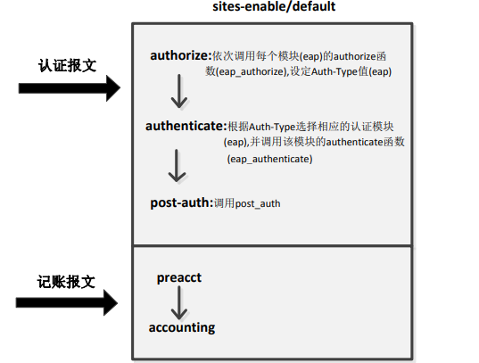
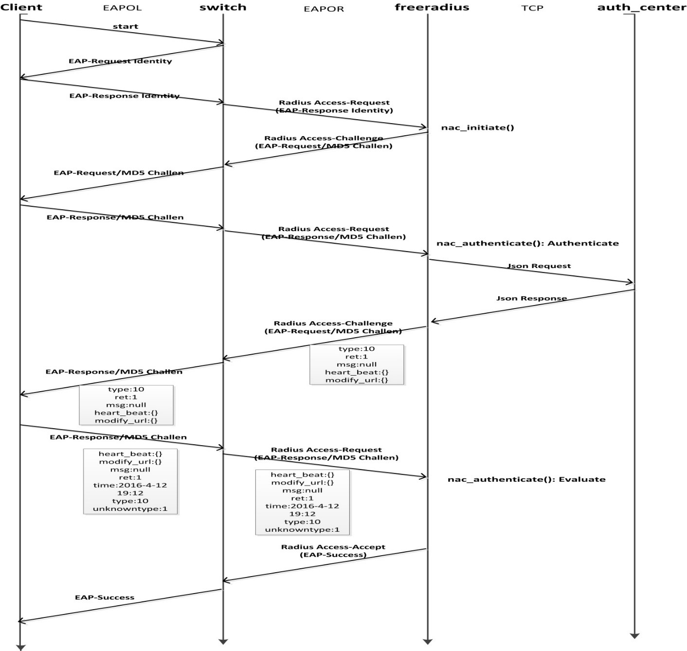

### freeradius2*
#### 编译

`./configure --prefix=/usr/local/ --with-udpfromto --with-openssl-includes=/usr/local/ssl/include --with-openssl-libraries=/usr/local/ssl/lib/`
`make&&make install`

### freeradius3*
#### 编译
openssl 1.1.1c版本

`./config  shared zlib-dynamic  --prefix=/usr/local/openssl/`
`make&&make install`

`./configure --prefix=/usr/local/rad3/ --with-udpfromto --with-openssl-include-dir=/usr/local/openssl/include/  --with-openssl-lib-dir=/usr/local/openssl/lib/`

`make&&make install`


### freeradius测试工具
#### eapol_test工具

集成域认证可以使用如下命令来模拟测试：
eapol_test -c peap-mschapv2.conf -s testing123
其中testing123为交换机接入点密钥；
peap-mschapv2.conf文件内容为：
network={
    ssid="example"
     key_mgmt=WPA-EAP
     eap=PEAP
     identity="ldaptest"
     anonymous_identity="ldaptest"
     password="123.com"
    phase2="auth=MSCHAPV2"

}

#### admin
 radmin -d  /usr/local/etc/raddb  -e "debug level 4"

#### radeapclient
radeapclient -x 127.0.0.1 auth testing123 -f req.txt -m aaaaa -a 1 -d /usr/local/etc/raddb/

-m: mid

-a：0表示用户名和密码认证，1表示主机（mid）认证

```
User-Name = "testing"
Cleartext-Password = "password"
Calling-Station-Id = "aa:aa:aa:bb:bb:bb"
EAP-Code = Response
EAP-Id = 210
EAP-Type-Identity = "testing"
Message-Authenticator = 0x00
NAS-IP-Address = 127.0.0.1
NAS-Port = 10
```


### freeradius源码分析
#### 启动流程
1. 加载配置文件read_mainconfig( )

* 读取配置文件(cf_file_read( )) radius.conf, clients.conf, proxy.conf, eap.conf, policy.conf, modules/, sites-enabled/defaults……….
* 读取字典文件(dict_init( ))，/usr/local/etc/raddb/dictionary
* 加载接入端配置文件(clients_parse_section( )) clients.conf

2. 加载模块setup_modules( )

* 先加载radiusd.conf中的instantiate{}里面的模块；
* 然后再加载sites-enables/default中的各个模块，调用每个模块的instantiation函数，module->instantiate( )
* 对于eap模块，同时会遍历里面的submodule(eap_instantiate( ))，eap-md5, eap-tls, eap-ttls,….
* 初始话socket, event和线程池radius_event_init( )
* loop event(radius_event_process( ))


#### 认证处理流程
服务端收到认证报文时，处理流程由default来指定(/usr/local/etc/raddb/sites-enabled/default)
* 先在 authorize 处理：让报文依次（有顺序）经过里面的各个模块的 authorize 函数的处理，然后设定 Auth-Type 值
* 然后 authenticate 处理：根据 Auth-Type 值直接选定里面的某个模块，直接由该模块的 authenticate 函数处理
  


