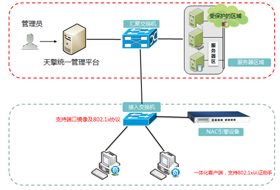

## 产品背景
### 安全挑战
1. 非法终端入网不可见

无准入网络，无法感知外来非法终端接入网络，并对齐封堵，会造成事件攻击、数据泄露等风险。

2. 漏洞终端入网不可查

无准入网络，无强制手段要求终端进行漏洞检查，造成带毒入网

3. 非法人员入网不可视

无准入网络，任何非法人员都能接入网络，出现非法攻击、数据盗取、不法言论，无法精准溯源

4. 网络边界私扩不可控

无准入网络，用户采用hub/小路由器私搭网络，造成非法外联、数据外泄

5. 手动网络授权不可信

无准入网络，采用IP/MAC关联ACL/VLAN等方式做静态权限控制，人员离职变动，易造成过期残留权限、漏洞面增大

6. 安全事件处理不及时

很多安全产品堆放在出口，安全时间仅能关联IP，无法直接关联终端和用户，无法快速从接入层处理非法终端和用户

7. 等保要求不达标

无准入网络，不符合等保分保等政策法规的要求

## 产品介绍
软硬件架构，实现对终端从接入身份识别验证、安全合规评估到违规处置等全生命周期入网管控防护；支持对接入网络边界的发现与控制、避免私搭乱建。基于终端身份与合规结果等条件动态控制终端准入的网络权限，通过网络权限最小化原则，实现网络安全风险最小化。系统支持联动各类安全监测设备，实现对风险设备的有效阻断、隔离、修复等措施，实现全方位、立体的防御体系

### 产品特性
1. 资产可见，全终端统计梳理

IP离网/在网/未使用 可视化； 传统终端/IOT终端 MAC/类型/状态等可视；终端在网、离网、变更等可视化。

2. 漏洞可察，全Day病毒查杀

内置CVE、CNNVD漏洞库、威胁引擎（QTDE）、IOT合规检测、联动天擎，实现全Day病毒查杀后接入

3. 人员可视，全人员智能准入

全身份源对接（LDAP/AD/Email/企业微信/钉钉等），界定身份合法；安全身份认证，杜绝设法仿冒

4. 边界可控，严防私搭乱建

边界拓扑可视；HUB/小路由器可视、穿透NAT实现实名认证；全阻断外联，避免信息泄露和考核

5. 基于身份，网络授权动态可信

基于终端可信身份/人的身份实现动态的网络权限控制

6. 纵深防御，安全事件及时处理

联动天擎杀毒/零信任/ICG单点登录， 联动NGSOC/攻击面检测/SOAR/天眼/LAS等实现数据联动

7. 安全合规，满足等保分保要求

对接入网络设备进行发现识别、强制身份认证、合规评估等

### NAC引擎设备
采用旁路部署，提供认证和策略执行服务，基于控制中心的集中式管理

### 控制中心
控制中心采用B/S架构，NAC的控制中心基于天擎控制台同台管理，管理员可以随时随地的通过浏览器打开访问，对NAC引擎下发配置策略，进行操作和监测管理。主要有认证配置模块、用户管理模块、认证源配置、会话管理、入网安全检查策略管理、集中管理、设备分组配置管理、日志报表等

### 客户端 
客户端部署在需要入网认证或安全检查的终端上，可提供802.1x认证拨号、入网合规检查、隔离修复、认证客户端交互配置等，并与服务器通信，接收控制中心管理所需入网策略配置和上报入网日志数据等信息。
如果是WEB Portal认证方式可无需安装客户端，可通过WEB方式进行核心保护区域的访问认证，也可采用天擎客户端联动方式的应用准入，哑终端可通过MAB MAC方式加入白名单来控制接入管理。

