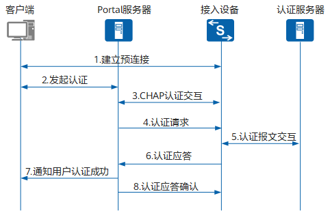

[Protal认证原理描述](https://support.huawei.com/enterprise/zh/doc/EDOC1100176388/609549d8)

### 接入设备
1. 认证之前，将用户所有的http/https请求都重定向到Portal Web服务器
2. 认证过程中，与Portal认证服务器、AAA服务器交互，完成身份认证/授权/计费的功能
3. 认证通过后，允许用户访问被授权的互联网资源

### Portal服务器
#### Portal Web服务器
向客户端提供Web认证页面，并将客户端的认证信息提交给Portal认证服务器。

#### Portal认证服务器
Portal认证服务器用于接收Portal客户端认证请求的服务器端系统，与接入设备交互认证客户端的认证信息。

### 认证方式
#### 二层认证方式
客户端与接入设备直连，二层认证流程简单，安全性高，但由于限制了用户只能与接入设备处于同一网段，降低了组网的灵活性

#### 三层认证方式
当设备部署在汇聚层或核心层，在认证客户端和设备之间存在三层转发设备，此时设备不一定能够获取到认证客户端的MAC地址，素以将IP地址唯一标识用户，此时需要将Portal认证配置为三层认证方式。
三层认证的客户端与接入设备之间没有建立预连接过程，其余报文处理流程跟二层认证完全一致。三层认证组网灵活，容易实现远程控制，但由于只有IP可以用来标识一个用户，所以安全性不高。
### Portal认证流程

协议的portal二层认证.png)

