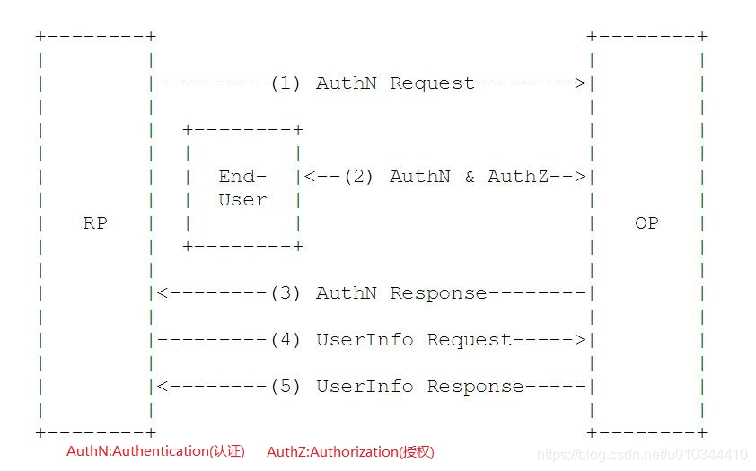
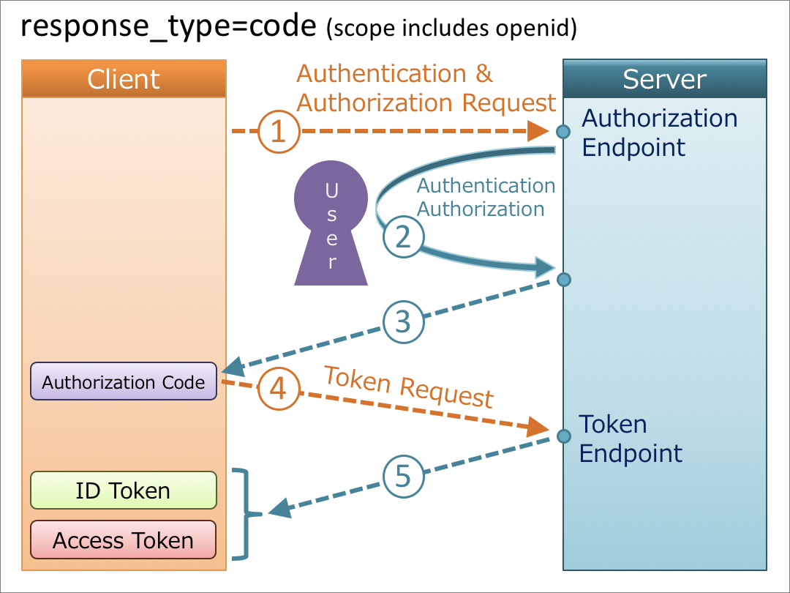

## 认证协议
OIDC	CAS	OAuth2	SAML	

## OIDC(OpenID Connect)
OpenID Connect (OIDC) 扩展了 OAuth 2.0 授权协议，使其也可用作身份验证协议。 可以使用 OIDC 通过一个称作“ID 令牌”的安全令牌在支持 OAuth 的应用程序之间启用单一登录 (SSO)

* OpenID Provider，指授权服务器，负责签发 Id Token。Authing 是 OpenID Provider
* 终端用户，Id Token 的信息中会包含终端用户的信息
* 调用方，请求 Id Token 的应用
* Id Token 由 OpenID Provider 颁发，包含关于终端用户的信息字段,JWT格式
* Claim 指终端用户信息字段

### 核心概念    
在OAuth2的授权流程中，一并提供用户的身份认证信息（ID Token）给到第三方客户端，ID Token使用JWT格式来包装，得益于JWT（JSON Web Token）的自包含性，紧凑性以及防篡改机制，使得ID Token可以安全的传递给第三方客户端程序并且容易被验证。此外还提供了UserInfo的接口，用于获取用户的更完整的信息

### 认证流程

* EU(End User)：一个人类用户。
* RP(Relying Party ): 用来代指OAuth2中的受信任的客户端，身份认证和授权信息的消费方；
* OP(OpenID Provider):有能力提供EU认证的服务（比如OAuth2中的授权服务），用来为RP提供EU的身份认证信息；
* ID Token：JWT格式的数据，包含EU身份认证的信息。
* UserInfo Endpoint：用户信息接口（受OAuth2保护），当RP使用Access Token访问时，返回授权用户的信息，此接口必须使用HTTPS。

流程

1. RP发送一个认证请求给OP；
2. OP对EU进行身份认证，然后提供授权；
3. OP把ID Token和Access Token（需要的话）返回给RP；
4. RP使用Access Token发送一个请求UserInfo EndPoint；
5. UserInfo EndPoint返回EU的Claims

### 概念

#### OIDC授权码模式
通过应用和OP之间交互获取用户信息

OIDC Provider对外暴露接口

#### 授权接口
#### ID_Token
OIDC对OAuth2最主要的扩展就是提供了ID Token。
ID Token是一个安全令牌，是一个授权服务器提供的包含用户信息（由一组Cliams构成以及其他辅助的Cliams）的JWT格式的数据结构

|字段|释义|
|---|----|
|iss(Issuer Identifier)|必须。提供认证信息者的唯一标识。一般是一个https的url（不包含querystring和fragment部分）|
|sub (Subject Identifier)|必须。iss提供的EU的标识，在iss范围内唯一。它会被RP用来标识唯一的用户。最长为255个ASCII个字符。|
|aud (Audience)|必须。标识ID Token的受众。必须包含OAuth2的client_id|
|exp (Expiration time)|必须。过期时间，超过此时间的ID Token会作废不再被验证通过|
|iat (Issued At Time)|必须。JWT的构建的时间|
|auth_time (AuthenticationTime)|EU完成认证的时间。如果RP发送AuthN请求的时候携带max_age的参数，则此Claim是必须的|
|nonce|RP发送请求的时候提供的随机字符串，用来减缓重放攻击，也可以来关联ID Token和RP本身的Session信息|
|acr (Authentication Context Class Reference)|可选。表示一个认证上下文引用值，可以用来标识认证上下文类|
|||
|||
