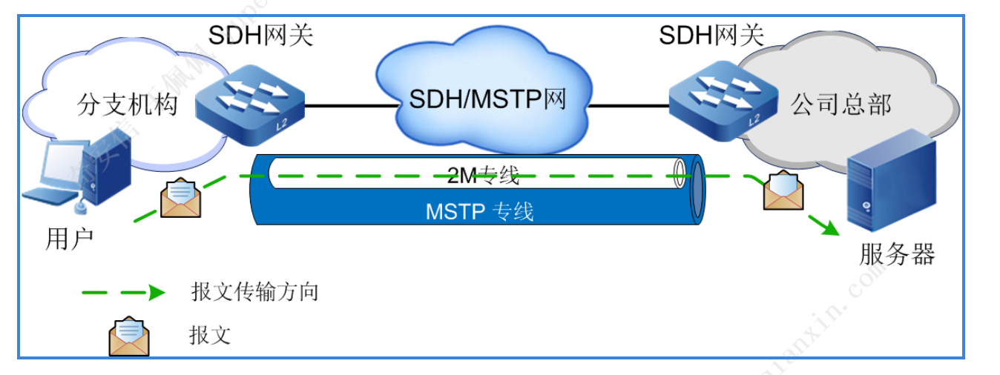

[专线相关](https://zhuanlan.zhihu.com/p/183088231)

### 裸纤
运营商提供一条纯净光纤线路，中间不经过任何交换机或路由器，只经过配线架或配线箱做光纤跳纤，可以理解成运营商仅仅提供一条物理线路

实际项目中，比如两个大学校区，租用运营商裸光纤实现两个校区互联，相当于将老校区网络作为一个子模块，接入到新校区，与新校区有机融合到一起，实现统一运营和管理；还比如教育城域网，实现教育局与辖区各学校互联，将网络出口统一到教育局，从而实现教育资源共享，统一审计等功能

### 专线
专线一般分为二层专线和三层专线，三层专线一般是指MPLS-VPN;我们日常说的基本是指二层专线，同裸纤实质性区别是：裸纤中间不经过任何路由器、交换机设备，是运营商给你真实的一根线，而专线中间经过各类路由器、交换机设备，只是运营商模拟出一根线(相关技术可以深入研究SDH,MSTP,PTN,OTN等)

#### SDH专线
为了防止信息泄露，在MSTP时代，可以在总部和分支机构之间搭建一条物理专网连接（SDH数字专线）

SDH（MSTP）数字专线技术存在如下缺点：
- 以PDH和SDH为代表的时分复用技术，作为上一代通信技术，与以太网是两种不同的技术路线。因此无法很好的承载在以太网上

- 独占硬件链路，导致即使没有数据时，链路也不能释放，极大地浪费网络资源。并且由于链路独占，无法与其他个人或组织分担专线的建设和维护资金，导致专线使用费用会异常昂贵

- 硬件专线在网络建设初期就需要设计和规划完毕，当使用过程中发现链路带宽有限，需要扩容时，由于硬件容量有限（例如接口数量有限），扩容较为困难

## VPN

  

IPSec 依赖于安全关联， 井且存在下列两个主要组件:
- 身份验证头(Authentication Header， Al却提供消息完整性和不可否认性的保证。AH 还提供身份认证和访问控制， 并且可以防止重放攻击。
- 安全封装有效载荷(Encapsulating Security Payload， ESP)提供数据包内容的机密性和完整性。ESP 还提供加密和有限的身份认证， 并且可以防止重放攻击。

IPSec 提供两种分离的操作模式。当IPSec 在运输模式中使用时， 只有数据包有效载荷被加密，这种模式为对等通信而设计。当IPSec 在隧道模式中使用时， 整个数据包(包括头)都会被加密， 这个模式为网关间通信而设计。

在运行时， 通过创建安全关联(Security Association， SA)来建立IPSec 会话。SA 表示通信会话，井且记录与特定连接有关的任何配置和状态信息。SA 表示单一连接。如果期望双向信道， 那么就需要两个SA， 每个方向分别使用一个SA。此外， 如果希望支持使用AH 和ESP 的双向信道， 那么就需要建立4 个SA 。
某些IPSec 的最大强度就来自于能够在每个SA 的基础上过滤或管理通信， 这样一来， 就可以严格管理其间存在安全关联的客户端或网关(即哪些类型的协议或服务可以使用IPSec 连接)。此外，如果没有定义有效的安全关联， 那么一对用户或网关就无法建立IPSec 链接。