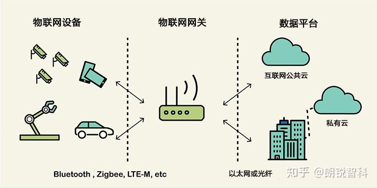

## 物联网网关
物联网网关就是物联网设备的中心枢纽，用来采集数据、感知信息并与网络进行通信，物联网网关是物联网生态系统中的关键要素之一。它处理所有传感器和远程连接的所有通信，在物联网传感器和互联网之间建立了桥梁。

物联网设备使用蓝牙LE，Zigbee，Z-wave或LTE，LTE-M，WiFi之类的的短距离无线传输模式连接物联网网关，然后将它们链接到Internet（公共云）通过以太网LAN或光纤WAN（HDLC / PPP）

物联网网关了解这些传输模式和数据（MQTT，CoAP，AMQP，DDS，Websocket）协议，并将其转换为数据系统所需的其他协议

### 主要功能
物联网的主要功能有：

- 通信桥接和M2M通信
- 用作数据缓存，缓冲区和流设备
- 离线服务和设备的实时控制汇总数据
- 发送数据之前对其进行预处理，清理和过滤 
- 此外，它提供了额外的安全性， 设备配置和变更管理

### 如何工作

当今网络中的大多数物联网设备都可以聚合数据。例如，汽车交通中的传感器可以聚合数据并将其发送到云中的AI分析服务。但是要到达云，传感器必须首先将所有这些原始数据发送到物联网网关。 物联网网关的简单过程是预处理，清理和过滤原始数据；翻译用于加密和通信的协议；将数据发送到Internet或Intranet上的目标

