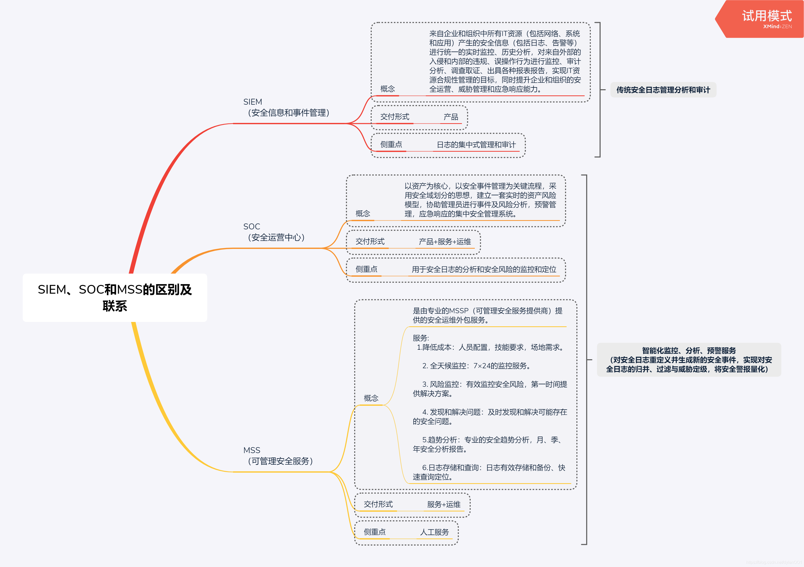

## SIEM、SOC、MSS

SIEM侧重于日志的集中式管理和审计，SOC则用于安全日志的分析和安全风险的监控与定位。两者的侧重点不同决定了，SIEM可以用产品来交附而SOC则必需加入MSS服务的人工干预来完善

MSS服务结合SOC则能做到智能化监控、分析、预警服务，改变过往自行维护繁复的安全信息与事件管理平台的习惯，摒弃安全信息与事件管理平台的复杂化，从管理的简易性、事件呈现、事件处理等角度提供解决方案，可以通过门户网站的模式获得所关心的内容，同时也可以在指定时间内通过电话等多种形式得到安全响应和相应的安全解决方案，在门户网站上也能得到更加详细的解决方案

Dos攻击

SYN攻击，使用SYN Cookie如何阻断； 降低TCP重置方法
防火墙可以通过检测和防御检测SYN攻击

TCP重置攻击

smurf攻击  ---使用ICMP回应数据包进行攻击，即使用受害者的IP地址作为源IP地址的伪造广播ping

fraggle攻击使用UDP的7和19端口

ping泛洪攻击，大量的系统同时给一个系统发送ping请求，导致受害者没有时间响应合法请求； 
解决方法：阻断ICMP流量； 主动入侵检测到ping泛洪攻击，然后通过修改系统环境来阻断ICMP流量；

### 入侵检测和防御系统

入侵检测系统(IDS)通过自动检测日志和实时系统事件以检测入侵和系统故障。

入侵检测系统能够有效检测许多DoS和DDoS攻击。它们可以识别来自外部连接的攻击， 如来自
互联网的攻击， 以及通过内部传播的攻击， 如恶意蠕虫。一旦发现可疑的事件， 便会通过发送或响
起警报的方式来做出回应。在某些情况下， 它们可以修改环境来阻止攻击。入侵检测系统的主要目
标是提供能够及时和准确应对入侵的方法。

入侵防御系统(IPS)具有入侵检测系统的所有功能， 而且还可以采取额外的措施来阻止或防止入
侵

入侵检测系统两种检测方法：
基于知识的检测

最常用的检测方法是基于知识的检测(又称为模式匹配检测或基于签名的检
测)。它使用由入侵检测系统供应商开发的己知攻击的数据库

基于知识的入侵检测系统的主要缺点是， 只对己知的攻击
方法有效。新的攻击或己知攻击被稍微修改版本， 入侵检测就会失效

基于行为的检测

检测类型是基于行为的检测(也被称为统计入侵检测、异常检测和基于
启发式的检坝。。基于行为的检测最开始在系统中创建正常活动和事件的基线。一旦积累足够多的能
够确定正常活动的基线数据， 便可以检测恶意入侵或恶意事件的异常活动。

基于行为的入侵检测系统的主要缺点是， 往往会发起大量的假警报， 也被称为虚假警报或误报

在某些情况下， 可以在防火墙的前后各放直一个被动式入侵检测系统， 以检查防火墙的有效性。
通过检查两个IDS 警报， 使能确定被防火墙阻挡的攻击类型而不是仅仅确定正在进行的攻击类型

入侵防御系统(IPS)是一种特殊类型的主动入侵检测系统， 能够在攻击到达目标系统之前进行检
测并阻止攻击， 有时也被称为入侵检测和防御系统(IDPS)。两者之间最主要的区别就是IPS 同流量
保持一致， 换句话说， 所有流量必须通过IPS，IPS 可以在分析之后选择将流量通
过或阻止。这使得IPS 能够阻止攻击到达目标

相反， 与流量不一致的IDS 只有在攻击到达目标之后才能检测到。主动IDS 能够在攻击开始之
后采取措施阻止攻击， 但不能预防攻击。
就像其他的IDS 一样， IPS 可以使用基于知识的检测矛W或基于行为的检测。此外， 可以记录活
动， 并像IDS 一样给管理员发出警报。

### 蜜罐/蜜网
蜜罐通过创建独立的计算机作为陷阱来捕获入侵者。可通过两个或多个联网蜜罐一起来模拟网
络。它们看起来像是合法的系统， 但它们对于攻击者不存放任何真实的有价值的数据。管理员通常
配置带有漏洞的蜜罐， 诱使入侵者攻击他们。它们可能是未打的补丁或管理员有意打开的安全漏洞。
目标是抓住入侵者的注意力， 井使入侵者远离保存有价值资源的合法网络。合法用户无法访问蜜罐，
因此对蜜罐的任何访问都很可能是未授权的入侵者

### 白名单/黑名单

一些白名单识别应用程序使用哈希算法来创建哈希。然而， 如果
一个应用程序感染了病毒， 该病毒可以有效地改变哈希， 因此自名单也能阻止这类被感染的应用程
序运行

### 防火墙

防火墙通过过滤流量为网络提供保护

基本的防火墙使用协议号过滤基于E 地址、端口和-些协议的流量。防火墙含有ACL 中的一
些规则， 能够允许特定的流量， 以及以隐式拒绝规则结束。隐式拒绝规则阻止以前的规则所不允许
的所有流量

第二代防火墙添加了额外的过滤功能。例如， 应用级网关防火墙能够过滤基于特定应用需求的
流量， 而电路级网关防火墙能够过滤基于通信电路的流量。第三代防火墙(也称为状态检测防火墙和
动态包过滤防火墙)能够过滤基于流量状态的流量。

下一代防火墙含有统一威肋、管理(Unified Threat Management， UTM)装置的功能， 并将几个过滤
功能结合在一起。它包括传统的功能， 如数据包过滤和状态检测。然而， 它能够执行数据包检测技
术， 使其能够识别和阻止恶意流量。它可以过滤使用定义文件和/或自名单和黑名单的恶意软件。它
还包括入侵检测和/或入侵防御功能

### 沙箱

沙箱为应用提供了一个安全边界， 以防止应用程序与其他应用程序交互。反恶意软件应用程序
使用沙箱技术来检测未知的应用。如果应用手里芋显示可疑特征， 沙箱技术能够防止应用程序感染其
他应用程序或操作系统

### 渗透测试

渗透测试通常包括漏洞扫描或漏洞评估以发现漏洞

### 日志、监控和审计

日志、监控和审计程序有助于组织防止事件发生， 并能够在事件发生时做出有效响应

### Q-SASE

### 防火墙

[防火墙](https://zhuanlan.zhihu.com/p/138100829)

为了增加防火墙组网的灵活性，设备不再定义整个设备的工作模式，而是定义接口的工作模式，接口的工作模式如下：

路由模式：如果设备接口具有 IP 地址通过三层与外连接，则认为该接口工作在路由模式下

透明模式：如果设备接口无 IP 地址通过二层对外连接，则认为该接口工作在透明模式下

如果设备既存在工作在路由模式的接口（接口具有 IP 地址），又存在工作在透明模式的接口（接口无 IP 地址），则认为该设备工作在混合模式下

### 网络探针

网络数据传感器(探针): 采集网络流量，对流量进行深度还原、威胁检测、数据提取、内容检测等处理；将生产出的日志、文件、PCAP样本等数据发送给大数据分析平台消费使用

网络流量采集与威胁检测系统是能够将流量数据、威胁数据进行采集、还原、解密、外发等能力于一体的高性能数据采集类产品，能够对威胁情报、恶意文件、漏洞、应用识别等多种数据进行检测，可对HTTPS等流量进行SSL解密、检测和还原等。结合奇安信数以百亿计的威胁情报储备、云检测和云沙箱的恶意文件检测能力等，极大的提升了奇安信网神网络流量采集与威胁检测系统全流量检测分析模块的威胁检测能力，助力多行业多场景的威胁感知和安全问题回溯。

安全+保密

### 隐私计算

### SASE(安全访问服务边缘)

SASE通过将网络和网络安全的功能融合为统一服务的模式，使分支机构人员和移动办公用户能够高效且安全的通过就近接入安全节点（部署在云端或者数据中心，称为POP点），访问互联网应用、公有云SaaS、公司内部应用等。

SASE是一种新兴的体系结构，将全面的WAN功能与全面的网络安全功能（例如SWG，CASB，FWaaS和ZTNA）结合在一起，可满足数字企业的动态安全访问需求

#### SASE必要性

一是为了解决传统架构的复杂性和延迟性；二是为了解决企业上云的数据安全问题

#### SASE覆盖场景

1. 从办公场所访问到自建应用、SaaS应用、互联网

2. 从互联网访问企业网站以及内部自建应用

#### SASE核心组件
1. 软件定义广域网（SD-WAN）
2. 身份识别与访问管理（IAM）
3. 零信任网络访问（ZTNA）
4. 云访问安全代理（CASB）
5. 安全web网关（SWG）
6. Web应用防护系统（WAF）
7. 防火墙即服务（FWaaS）

#### SASE优势
将众多不同的网络服务融合和统一到一个针对边缘环境和独立用户的代理结构中，而传统方法往往需要多个供应商和服务来实现相同的控制，利用SASE有助于降低传统方法的复杂性和缺乏互操作性，从而提高安全性

1. 降低了传统方法的复杂性和成本
2. 减少了企业跟供应商间的不必要交流
3. 减少了分支机构和其它远程位置所需的硬件数量
4. 减少了终端用户设备上的代理数量

### 零信任(ZTNA)

ZTNA之所以可以用于替换VPN，主要基于以下三点：

1. 用户体验
   
   ZTNA技术专为云时代而设计，旨在增强用户体验。无论用户是在办公室、星巴克，还是在飞行中，都可以从他们选择的设备或位置，简单而安全地访问企业服务器

2. 安全

   ZTNA使组织可以从以网络为中心的方法转向以用户和应用程序为中心的安全策略。通过将应用程序访问与网络访问分离，用户不再位于企业网络上（没有FW策略或ACL)。互联网可以通过加密隧道构成新的安全网络，而加密隧道可以使应用程序保持私有状态，而无需VPN

   ZTNA技术实际上可以通过使用由内而外的连接使私有应用程序不可见，因此IP永远不会暴露于Internet中，并且网络边缘没有VPN集中器来监听入站ping。由于他们使用微分段策略，而不是网络分段，因此ZTNA会在授权用户和命名应用程序之间创建一个安全的分段，从而减少了管理网络分段的开销。

   VPN就像是城堡式护城河的网络安全方法，在外部创建（并非如此）坚固的外围，但内部则容易受到城堡内任何人的攻击。这使得很难将安全风险降到最低。ZTNA和SDP在每个私有应用程序周围创建一个安全的隔离环境，并仅向特定的授权用户提供最小特权的访问

3. 可见性和控制力

   随着移动性的增加，IT要求对网络、用户和企业服务器有更高级别的可见性和控制力。安全团队需要具有轻松监视、识别和诊断针对企业的任何安全威胁的能力。

   使用VPN，安全团队可掌握的信息仅限于访问设备的IP地址、端口数据和协议。因此，可以看到谁登录以及从哪个IP地址登录，但是看不到用户在网络上实际在做什么。

   ZTNA使管理员能够获得有关用户和应用程序之间所有活动的全面信息。基于ZTNA的解决方案不仅可以实时跟踪每个活动、列出IP和端口，还可以捕获用户身份、延迟、位置等数据。因此，管理员可以轻松地使用和分析这些信息，然后可以将数据实时自动传输到SIEM提供程序。

   一些解决方案还可以发现在环境中运行的先前未知的私有应用程序，在GUI中显示它们，并允许安全团队强制执行精细的管控。

### 身份访问管理(IAM)和特权访问管理(PAM)

